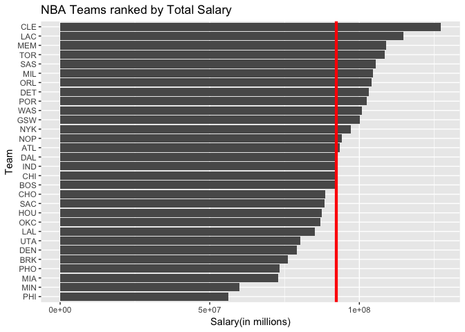
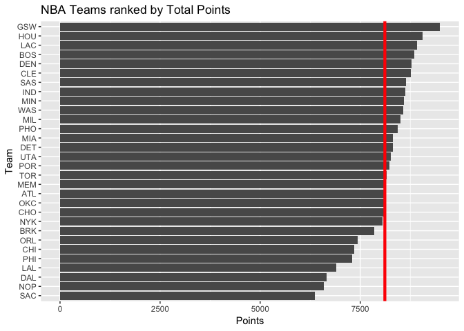
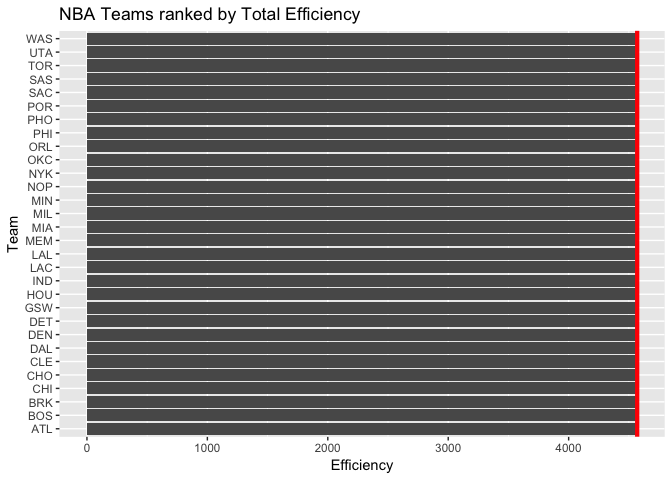
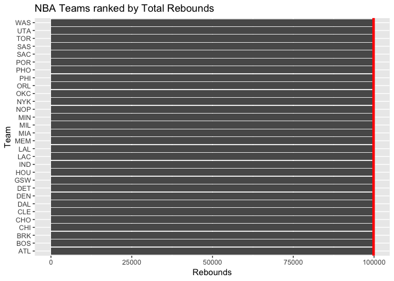

workout1
================
Sunny Sun
10/1/2018

``` r
library(readr)
library(dplyr)
```

    ## 
    ## Attaching package: 'dplyr'

    ## The following objects are masked from 'package:stats':
    ## 
    ##     filter, lag

    ## The following objects are masked from 'package:base':
    ## 
    ##     intersect, setdiff, setequal, union

``` r
nba2018<-read_csv("~/Desktop/hw-stat133/workout01/data/nba2018.csv")
```

    ## Parsed with column specification:
    ## cols(
    ##   .default = col_integer(),
    ##   player = col_character(),
    ##   number = col_character(),
    ##   team = col_character(),
    ##   position = col_character(),
    ##   height = col_character(),
    ##   birth_date = col_character(),
    ##   country = col_character(),
    ##   experience = col_character(),
    ##   college = col_character(),
    ##   salary = col_double(),
    ##   field_goals_perc = col_double(),
    ##   points3_perc = col_double(),
    ##   points2_perc = col_double(),
    ##   effective_field_goal_perc = col_double(),
    ##   points1_perc = col_double()
    ## )

    ## See spec(...) for full column specifications.

``` r
nba2018$experience[nba2018$experience=="R"]<-0
nba2018$experience<-as.integer(nba2018$experience)
salary<-nba2018$salary/1000000
position<-factor(nba2018$position,levels=c("C","PF","PG","SF","SG"),labels = c("center","power_fwd","point_guard","small_fwd","shoot_guard"))
missed_fg<-nba2018$field_goals_atts - nba2018$field_goals
missed_ft<-nba2018$points1_atts-nba2018$points1
rebounds<-nba2018$off_rebounds + nba2018$def_rebounds
efficiency<- (nba2018$points+nba2018$total_rebounds+nba2018$assists+nba2018$steals+nba2018$blocks-missed_fg-missed_ft-nba2018$turnovers)/nba2018$games
summary_efficiency<-summary(efficiency)
summary_efficiency
```

    ##    Min. 1st Qu.  Median    Mean 3rd Qu.    Max. 
    ## -0.6667  5.0000  8.3472  9.5788 12.6066 33.8272

``` r
sink("../output/eficiency-summary.txt")
teams<-summarise(group_by(nba2018,team), experience=round(sum(experience)),salary=round(sum(salary)),points3=sum(points3),points2=sum(points2),points1=sum(points1),points=sum(points),off_rebounds=sum(off_rebounds),def_rebounds=sum(def_rebounds),assists=sum(assists),steals=sum(steals),blocks=sum(blocks),turnovers=sum(turnovers),fouls=sum(fouls),efficiency=sum(efficiency))
summary_teams<-summary(teams)
summary_teams
```

    ##      team             experience         salary             points3      
    ##  Length:30          Min.   : 39.00   Min.   : 56293357   Min.   : 519.0  
    ##  Class :character   1st Qu.: 59.00   1st Qu.: 85589421   1st Qu.: 620.0  
    ##  Mode  :character   Median : 67.50   Median : 92724568   Median : 718.0  
    ##                     Mean   : 74.13   Mean   : 92294685   Mean   : 737.8  
    ##                     3rd Qu.: 83.00   3rd Qu.:102928056   3rd Qu.: 805.8  
    ##                     Max.   :145.00   Max.   :127254579   Max.   :1140.0  
    ##     points2        points1         points      off_rebounds  
    ##  Min.   :1754   Min.   : 998   Min.   :6360   Min.   :521.0  
    ##  1st Qu.:2104   1st Qu.:1240   1st Qu.:7906   1st Qu.:711.0  
    ##  Median :2290   Median :1426   Median :8240   Median :780.0  
    ##  Mean   :2263   Mean   :1375   Mean   :8114   Mean   :776.9  
    ##  3rd Qu.:2458   3rd Qu.:1495   3rd Qu.:8611   3rd Qu.:863.0  
    ##  Max.   :2638   Max.   :1623   Max.   :9491   Max.   :962.0  
    ##   def_rebounds     assists         steals          blocks     
    ##  Min.   :1876   Min.   :1183   Min.   :483.0   Min.   :232.0  
    ##  1st Qu.:2455   1st Qu.:1551   1st Qu.:543.0   1st Qu.:318.2  
    ##  Median :2600   Median :1753   Median :591.5   Median :357.5  
    ##  Mean   :2552   Mean   :1744   Mean   :588.9   Mean   :363.0  
    ##  3rd Qu.:2692   3rd Qu.:1882   3rd Qu.:626.8   3rd Qu.:392.5  
    ##  Max.   :2869   Max.   :2486   Max.   :782.0   Max.   :554.0  
    ##    turnovers          fouls        efficiency  
    ##  Min.   : 674.0   Min.   :1168   Min.   :4569  
    ##  1st Qu.: 972.8   1st Qu.:1444   1st Qu.:4569  
    ##  Median :1029.5   Median :1567   Median :4569  
    ##  Mean   :1025.0   Mean   :1519   Mean   :4569  
    ##  3rd Qu.:1100.5   3rd Qu.:1620   3rd Qu.:4569  
    ##  Max.   :1212.0   Max.   :1887   Max.   :4569

``` r
sink("../data/teams-summary.txt")


write.csv(summary_teams, "../data/nba2018-teams.csv")
library(ggplot2)
library(readr)
library(dplyr)
dat <- read_csv("../data/nba2018-teams.csv")
```

    ## Warning: Missing column names filled in: 'X1' [1]

    ## Parsed with column specification:
    ## cols(
    ##   X1 = col_character(),
    ##   team = col_character(),
    ##   experience = col_character(),
    ##   salary = col_character(),
    ##   points3 = col_character(),
    ##   points2 = col_character(),
    ##   points1 = col_character(),
    ##   points = col_character(),
    ##   off_rebounds = col_character(),
    ##   def_rebounds = col_character(),
    ##   assists = col_character(),
    ##   steals = col_character(),
    ##   blocks = col_character(),
    ##   turnovers = col_character(),
    ##   fouls = col_character(),
    ##   efficiency = col_character()
    ## )

``` r
salary_teams <- teams %>%
  group_by(teams$team) %>% summarize(salaries=sum(salary))

ggplot(salary_teams, aes(x = reorder(teams$team, +salaries), y = salaries)) + 
  geom_bar(stat = 'identity') + 
  coord_flip() +
  labs(y = "Salary(in millions)", x = "Team", title = "NBA Teams ranked by Total Salary") + 
  geom_hline(aes(yintercept = mean(salaries)), colour = "red", size = 1.5)
```



``` r
points_teams <- teams %>%
  group_by(team) %>% 
  summarise(points=sum(points))
ggplot(points_teams, aes(x = reorder(team, +points), y = points)) + 
  geom_bar(stat = 'identity') + 
  coord_flip() +
  labs(y = "Points", x = "Team", title = "NBA Teams ranked by Total Points") + 
  geom_hline(aes(yintercept = mean(points)), colour = "red", size = 1.5)
```



``` r
eff_teams <- teams %>%
  group_by(team) %>% 
  summarise(eff=sum(efficiency))

ggplot(eff_teams, aes(x = reorder(team, +eff), y = eff)) + 
  geom_bar(stat = 'identity') + 
  coord_flip() +
  labs(y = "Efficiency", x = "Team", title = "NBA Teams ranked by Total Efficiency") + 
  geom_hline(aes(yintercept = mean(eff)), colour = "red", size = 1.5)
```



``` r
#rank teams by total rebounds

r_teams <- teams %>%
  group_by(teams$team) %>% 
  summarise(reb=sum(teams$off_rebounds + teams$def_rebounds))
ggplot(r_teams, aes(x = reorder(teams$team, +reb), y = +reb)) + 
  geom_bar(stat = 'identity') + 
  coord_flip() +
  labs(y = "Rebounds", x = "Team", title = "NBA Teams ranked by Total Rebounds") + 
  geom_hline(aes(yintercept = mean(reb)), colour = "red", size = 1.5)
```



``` r
###Comments
#Very difficult, spend over 7 hours doing it. 
```
